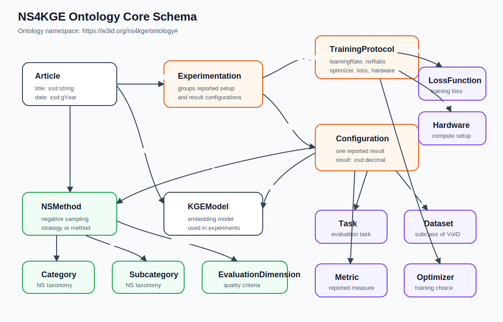

# NS4KGE Ontology

Reusable ontology for representing scientific papers about knowledge graph embeddings and negative sampling.

## Contents
- `ontology/NSArticles_ontology.ttl` is the authoritative OWL/Turtle ontology.
- `ontology/NSArticles_shapes.ttl` is generated SHACL from ontology domains, ranges, and cardinality restrictions.
- `docs/competency_questions.md` lists the competency questions used by the paper.
- `examples/minimal_instance.ttl` is a synthetic example instance; it is not derived from any published paper.

## Version
- Current artifact version: `v1.0.0`.
- For the first public GitHub release, create the release/tag as `v1.0.0`.

## Persistent Identifiers
- Ontology IRI: `https://w3id.org/ns4kge/ontology`.
- Ontology term namespace: `https://w3id.org/ns4kge/ontology#`.
- Version IRI: `https://w3id.org/ns4kge/ontology/1.0.0`.
- Class example: `https://w3id.org/ns4kge/ontology#Article`.
- Property example: `https://w3id.org/ns4kge/ontology#hasConfiguration`.

## Resource Availability
- Repository: `https://github.com/IlyesTebourski/ns4kge-ontology`.
- Release target: `v1.0.0`.
- Release date: 2026-05-06.
- License: CC BY 4.0.
- Zenodo DOI: pending archival of the public `v1.0.0` release.
- Dereferenceable ontology IRI: `https://w3id.org/ns4kge/ontology`.

The repository contains only the ontology, generated SHACL shapes, documentation, and synthetic examples. It does not redistribute source article text.

## Schema Diagram



## Core Model
- `Article` describes a scientific article.
- `NSMethod` describes negative sampling methods proposed, mentioned, or evaluated in configurations.
- `KGEModel` describes knowledge graph embedding models.
- `Experimentation` connects an article to one `TrainingProtocol` and one or more `Configuration` instances.
- `Configuration` captures `Task`, `Dataset`, `Metric`, optional `KGEModel`, optional `NSMethod`, and a numeric `result`.

## Modeling Choices
- Articles are modeled as `ns4kge:Article` and subclass `bibo:AcademicArticle` to reuse an established bibliographic type.
- Experimental evidence is separated from bibliographic metadata through `ns4kge:Experimentation`.
- `ns4kge:Configuration` represents one reported result for a task, dataset, metric, KGE model, and optional negative sampling method.
- Negative sampling categories and subcategories are attached to `ns4kge:NSMethod`, not directly to articles.
- Benchmark datasets are modeled as `ns4kge:Dataset` and subclass `void:Dataset`.
- The ontology uses `dcterms` for artifact metadata, `vann` for preferred namespace metadata, BIBO for article alignment, and VoID for dataset alignment.

## Sustainability And Maintenance
- The first intended public release is `v1.0.0`.
- Ontology term IRIs are intended to remain stable under `https://w3id.org/ns4kge/ontology#`.
- Breaking ontology changes should use a new version IRI and release tag.
- SHACL shapes are generated from ontology domains, ranges, and cardinality restrictions using the companion extraction pipeline.

## Limitations
- The ontology focuses on negative sampling for knowledge graph embeddings and is not a general ontology of all machine-learning experiments.
- SHACL shapes reflect the current modeling constraints and should not be interpreted as complete semantic validation of extracted scientific claims.
- The populated knowledge graph is produced by a separate LLM-assisted extraction pipeline, so extraction errors and omissions are outside this ontology artifact.
- Source article text is excluded for copyright reasons.

## Tooling
Python tooling lives in the separate `ns4kge-extraction-pipeline` artifact. From that folder, regenerate shapes with:

```bash
uv run nofacts-gen-shapes --ontology ../ns4kge-ontology/ontology/NSArticles_ontology.ttl --out ../ns4kge-ontology/ontology/NSArticles_shapes.ttl
```

Validate a populated KG with:

```bash
uv run nofacts-validate --data ../ns4kge-kg/kg/NSArticles_populated.ttl --shapes ../ns4kge-ontology/ontology/NSArticles_shapes.ttl
```

## License
Ontology files, documentation, and examples are licensed under CC BY 4.0.
